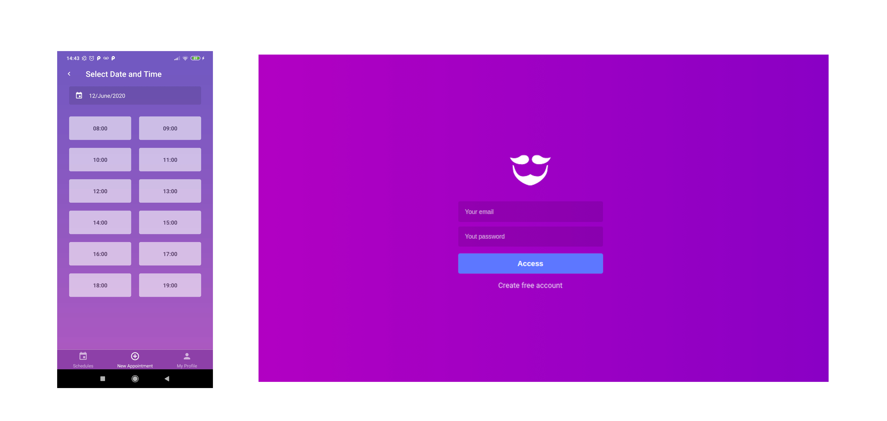

<h1 align="center">
	
</h1>

<h4 align="center">
  :barber: &nbsp; GoBarber :barber:
</h4>

  

  

  

  

This project is divided into three parts, which are: REST API, Web and Mobile. These can be accessed at the links below:

- [REST API](https://github.com/Leonardofreua/GoBarber/tree/master/backend)
- [Web client](https://github.com/Leonardofreua/GoBarber/tree/master/frontend)
- [Mobile client](https://github.com/Leonardofreua/GoBarber/tree/master/mobile)

## 📝 License

This project is under the MIT license. See [LICENSE](LICENSE) file for more details.

---

Made by Leonardo Freua [See my linkedin](https://www.linkedin.com/in/leonardo-freua-aa3a40138/)
