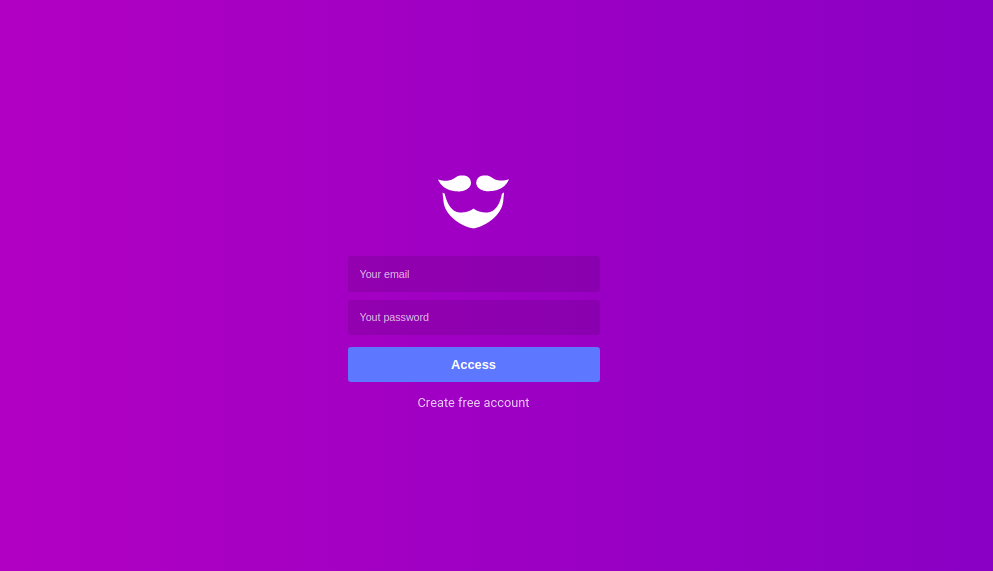
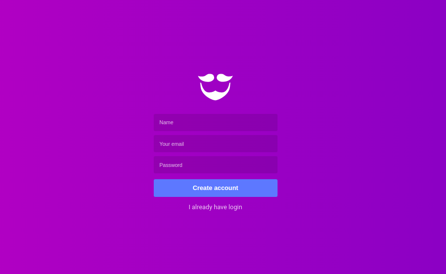
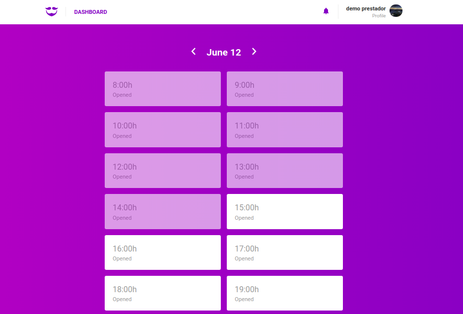
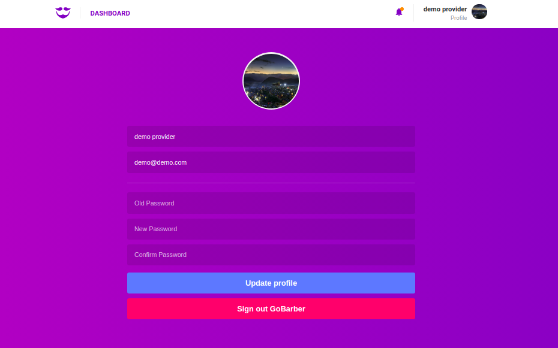

<h1 align="center">
  
</h1>

<h3 align="center">
  GoBarber ReactJS Application
</h3>

<p align="center">
  <a href="https://www.linkedin.com/in/leonardo-freua-aa3a40138/" target="_blank" rel="noopener noreferrer">
    
  </a>
</p>

<p align="center">
  <a href="#%EF%B8%8F-about-the-project">About the project</a>&nbsp;&nbsp;&nbsp;|&nbsp;&nbsp;&nbsp;
  <a href="#-technologies">Technologies</a>&nbsp;&nbsp;&nbsp;|&nbsp;&nbsp;&nbsp;
  <a href="#-getting-started">Getting started</a>&nbsp;&nbsp;&nbsp;|&nbsp;&nbsp;&nbsp;
  <a href="#-how-to-contribute">How to contribute</a>&nbsp;&nbsp;&nbsp;|&nbsp;&nbsp;&nbsp;
  <a href="#-license">License</a>
</p>

</br>

### Sign In
<p align="center">
  
</p>

### Sign Up

<p align="center">
  
</p>

### Dashboard

<p align="center">
  
</p>

### Profile

<p align="center">
  
</p>


## 💇🏻‍♂️ &nbsp; About the project

This is the Web version of GoBarber, which has Service Providers (barbers or hairdressers) as its central user. Through this, each service provider will ask to manage the appointments that were made for him, if a new appointment is made the provider will receive a notification and he can also change his profile as he wishes

To see the **api**, click here: [GoBarber REST API](https://github.com/Leonardofreua/GoBarber/tree/master/backend)</br>
To see the **mobile client**, click here: [GoBarber Mobile](https://github.com/Leonardofreua/GoBarber/tree/master/mobile)

## 🚀 &nbsp; Technologies

Technologies that I used to develop this web client

- [ReactJS](https://reactjs.org/)
- [ReduxJS](https://redux.js.org/)
- [Redux-Saga](https://redux-saga.js.org/)
- [React Router DOM](https://reacttraining.com/react-router/)
- [React Icons](https://react-icons.github.io/react-icons/)
- [React-toastify](https://fkhadra.github.io/react-toastify/)
- [Redux-persist](https://github.com/rt2zz/redux-persist)
- [Immer](https://immerjs.github.io/immer/docs/introduction)
- [Date-fns](https://date-fns.org/)
- [UnForm](https://unform.dev/)
- [Yup](https://github.com/jquense/yup)
- [Styled Components](https://styled-components.com/)
- [Polished](https://github.com/styled-components/polished)
- [Axios](https://github.com/axios/axios)
- [Eslint](https://eslint.org/)
- [Prettier](https://prettier.io/)
- [EditorConfig](https://editorconfig.org/)

## 💻 &nbsp; Getting started

### Requirements

- Have this application's [API](https://github.com/Leonardofreua/GoBarber/tree/master/backend) running

**Follow the steps below**

```bash
# Install the dependencies
$ yarn

# Be sure the file 'src/services/api.js' have the IP and PORT to your API

# Start the client
$ yarn start
```

## 🤔 &nbsp; How to contribute

- Fork this repository;
- Create a branch with your feature: `git checkout -b my-feature`;
- Commit your changes: `git commit -m 'feat: My new feature'`;
- Push to your branch: `git push origin my-feature`.

After your pull request is merged, you can delete your branch

## 📝 &nbsp; License

This project is licensed under the MIT License - see the [LICENSE](LICENSE) file for details.

---

Made by Leonardo Freua [See my linkedin](https://www.linkedin.com/in/leonardo-freua-aa3a40138/)
