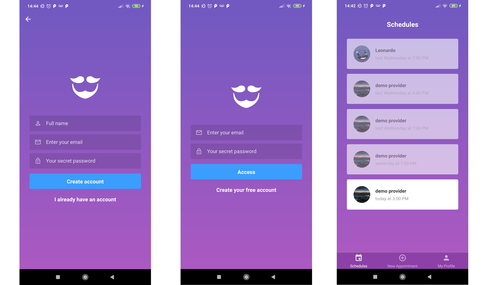
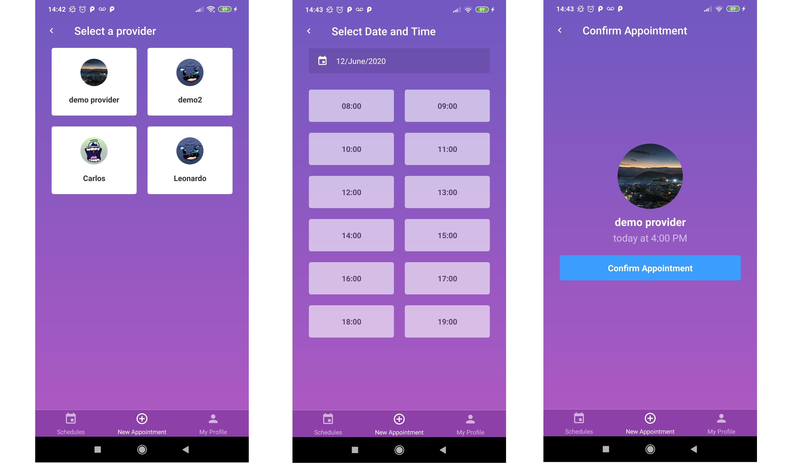
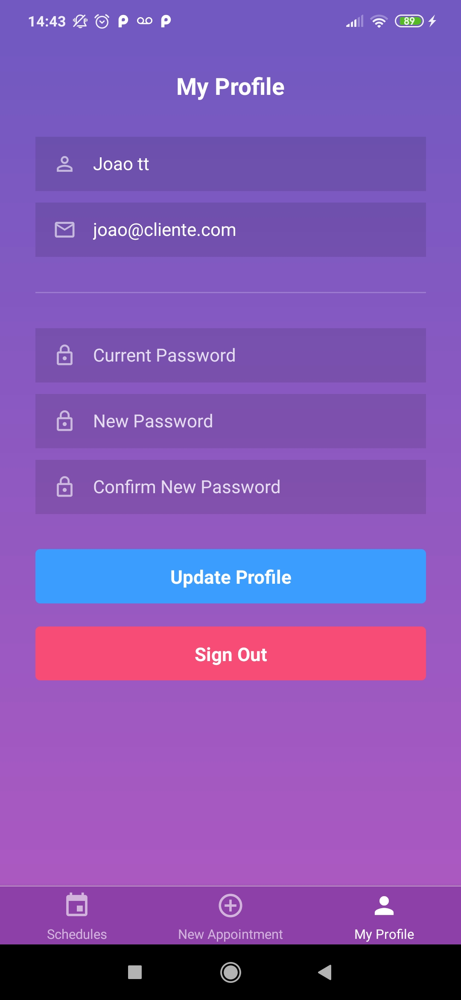

<h1 align="center">
  
</h1>

<h3 align="center">
  GoBarber React Native Application
</h3>

<p align="center">
  <a href="https://www.linkedin.com/in/leonardo-freua-aa3a40138/" target="_blank" rel="noopener noreferrer">
    
  </a>
</p>

<p align="center">
  <a href="#%EF%B8%8F-about-the-project">About the project</a>&nbsp;&nbsp;&nbsp;|&nbsp;&nbsp;&nbsp;
  <a href="#-technologies">Technologies</a>&nbsp;&nbsp;&nbsp;|&nbsp;&nbsp;&nbsp;
  <a href="#-getting-started">Getting started</a>&nbsp;&nbsp;&nbsp;|&nbsp;&nbsp;&nbsp;
  <a href="#-how-to-contribute">How to contribute</a>&nbsp;&nbsp;&nbsp;|&nbsp;&nbsp;&nbsp;
  <a href="#-license">License</a>
</p>

</br>

<p align="center">
  
</p>

---

<p align="center">
  
</p>

---

<p align="center">
  
</p>

## 💇🏻‍♂️ About the project

This is the Mobile version of GoBarber, which has as its central user the customers of a barber shop. Through this, customers will be able to select service providers and make appointments at the times they wish, as well as view their history of previous appointments.

To see the **api**, click here: [GoBarber REST API](https://github.com/Leonardofreua/GoBarber/tree/master/backend)</br>
To see the **Web client**, click here: [GoBarber Web](https://github.com/Leonardofreua/GoBarber/tree/master/frontend)

## 🚀 Technologies

Technologies that I used to develop this web client

- [ReactJS](https://reactjs.org/)
- [React Native](https://reactnative.dev/)
- [ReduxJS](https://redux.js.org/)
- [Redux-Saga](https://redux-saga.js.org/)
- [React Navigation](https://reactnavigation.org/)
- [React Native Vector Icons](https://github.com/oblador/react-native-vector-icons)
- [Styled Components](https://styled-components.com/)
- [Immer](https://immerjs.github.io/immer/docs/introduction)
- [Date-fns](https://date-fns.org/)
- [Axios](https://github.com/axios/axios)
- [Eslint](https://eslint.org/)
- [Prettier](https://prettier.io/)
- [EditorConfig](https://editorconfig.org/)

## 💻 &nbsp; Getting started

### Requirements

- Have this application's [API](https://github.com/Leonardofreua/GoBarber/tree/master/backend) running

**Follow the steps below**

```bash
# Install the dependencies
$ yarn

# Be sure the file 'src/services/api.js' have the IP to your API

# If you are going to emulate with android, run the commands below
$ react-native run-android
$ react-native start --reset-cache


# If you are going to emulate with ios, run this command
$ react-native run-ios
$ react-native start --reset-cache

# In both cases, if any problem occurs, turn the command below
$ react-native start --reset-cache

```
## 🤔 &nbsp; How to contribute

- Fork this repository;
- Create a branch with your feature: `git checkout -b my-feature`;
- Commit your changes: `git commit -m 'feat: My new feature'`;
- Push to your branch: `git push origin my-feature`.

After your pull request is merged, you can delete your branch

## 📝 &nbsp; License

This project is licensed under the MIT License - see the [LICENSE](LICENSE) file for details.

---

Made by Leonardo Freua [See my linkedin](https://www.linkedin.com/in/leonardo-freua-aa3a40138/)
